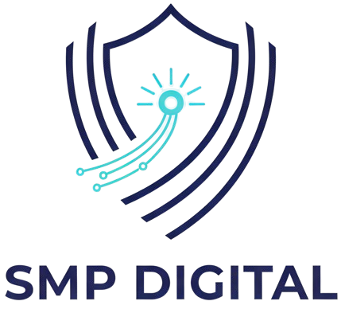

<!-- Path diubah menjadi path direktori relatif -->

<h1 align="center">LMS SMP Digital - Backend</h1>

Ini adalah backend API untuk aplikasi Learning Management System (LMS) SMP Digital. Dibangun menggunakan Laravel, API ini menyediakan semua fungsionalitas inti yang dibutuhkan oleh aplikasi, termasuk autentikasi pengguna, manajemen konten pembelajaran, dan interaksi antar pengguna.

Backend ini dirancang untuk menjadi headless, artinya ia hanya fokus pada penyediaan data dalam format JSON dan tidak memiliki tampilan sendiri. Ia melayani data untuk Frontend Next.js (ganti dengan link repo frontend Anda).

✨ Fitur Utama
Autentikasi Aman: Menggunakan Laravel Sanctum untuk autentikasi berbasis token.

Manajemen Peran: Sistem membedakan antara peran Guru dan Murid dengan hak akses yang berbeda.

Manajemen Materi: Guru dapat mengupload file materi (PDF, DOCX, dll.) untuk setiap kelas.

Manajemen Tugas & Penilaian: Guru dapat membuat tugas, dan murid dapat mengumpulkan jawaban. Guru kemudian dapat memberikan nilai dan feedback.

Forum Diskusi: Pengguna dapat membuat topik diskusi baru dan saling membalas komentar di dalam kelas mereka.

Manajemen Profil: Pengguna dapat memperbarui informasi pribadi mereka, termasuk nama, email, password, dan foto profil.

Fitur Tambahan: Termasuk rekap nilai, pencarian, dan ekspor data nilai ke PDF untuk wali kelas.

🛠️ Teknologi yang Digunakan
PHP

Laravel Framework

MySQL

Laravel Sanctum (untuk Autentikasi API)

barryvdh/laravel-dompdf (untuk Ekspor PDF)

🚀 Panduan Instalasi Lokal
Berikut adalah cara untuk menjalankan proyek ini di lingkungan development lokal Anda menggunakan Laragon.

Prasyarat
Laragon (atau environment sejenis seperti XAMPP/WAMP dengan Composer)

Git

Langkah-langkah Instalasi
Clone Repositori
Buka terminal Laragon Anda, masuk ke direktori www, lalu clone proyek ini:

git clone [https://github.com/fadillrr/lms-smp-backend.git](https://github.com/fadillrr/lms-smp-backend.git)
cd lms-smp-backend

Install Dependensi
Gunakan Composer untuk menginstal semua paket PHP yang dibutuhkan.

composer install

Setup File Environment (.env)
Salin file contoh .env dan buat file .env Anda sendiri.

copy .env.example .env

Buka file .env yang baru dibuat dan sesuaikan konfigurasi database Anda. Pengaturan default Laragon biasanya sudah sesuai.

DB_CONNECTION=mysql
DB_HOST=127.0.0.1
DB_PORT=3306
DB_DATABASE=lms_smp  // Pastikan Anda sudah membuat database ini
DB_USERNAME=root
DB_PASSWORD=

Generate Kunci Aplikasi
Setiap aplikasi Laravel memerlukan kunci enkripsi yang unik.

php artisan key:generate

Jalankan Migrasi Database
Perintah ini akan membuat semua tabel yang dibutuhkan di dalam database lms_smp.

php artisan migrate

Buat Symbolic Link untuk Storage
Ini sangat penting agar file yang diupload (seperti foto profil) bisa diakses dari web.

php artisan storage:link

Jalankan Server Development
Sekarang, Anda siap menjalankan server backend.

php artisan serve

Server akan berjalan di http://127.0.0.1:8000.

(Opsional) Menambahkan Data Awal
Untuk mengisi database Anda dengan data contoh (1 guru, 1 murid, dll.), Anda bisa menjalankan php artisan tinker dan menempelkan kode seeder yang telah kita gunakan selama proses development.

Dengan mengikuti langkah-langkah ini, backend API Anda akan berjalan dan siap menerima permintaan dari frontend.